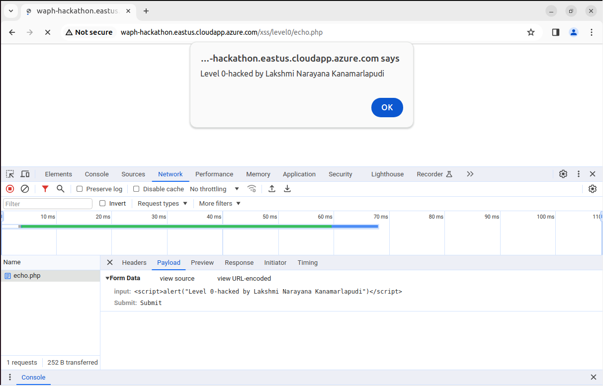
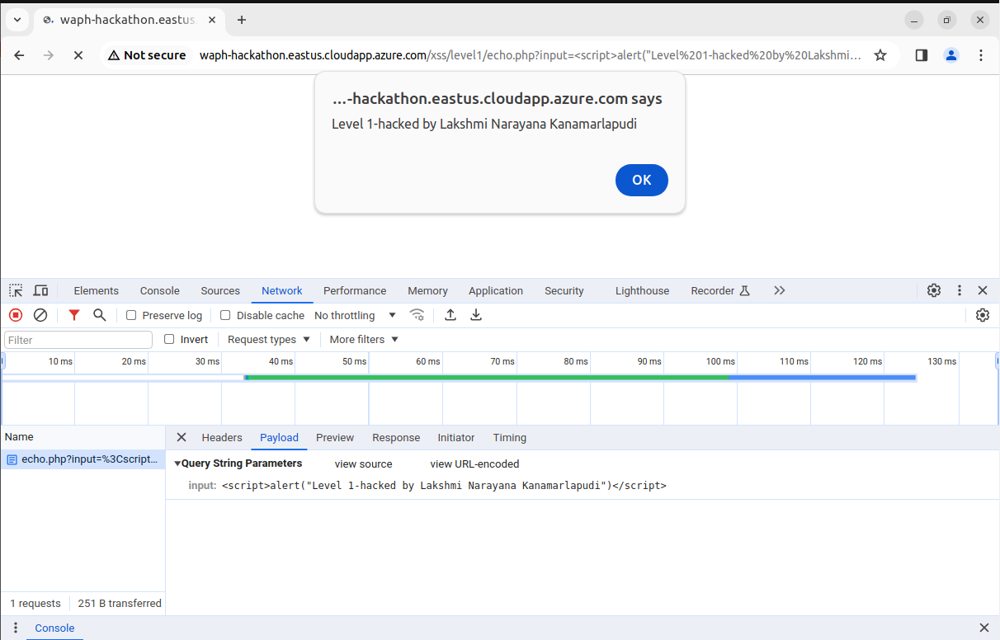
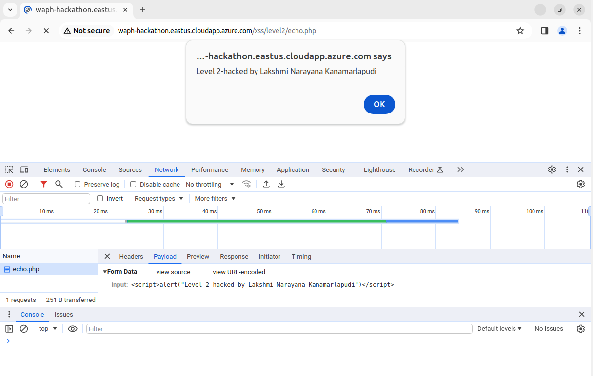
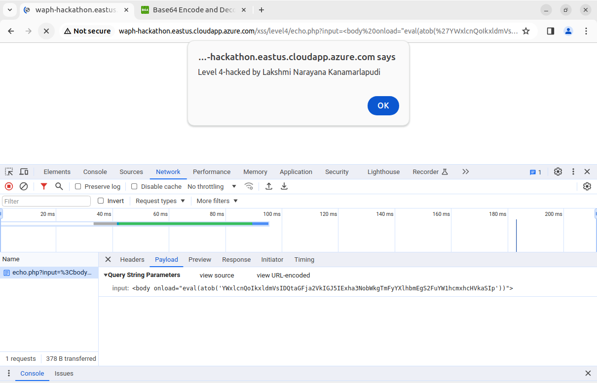
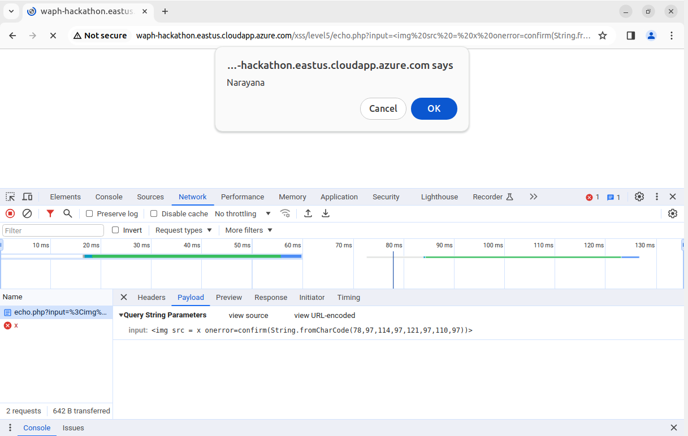
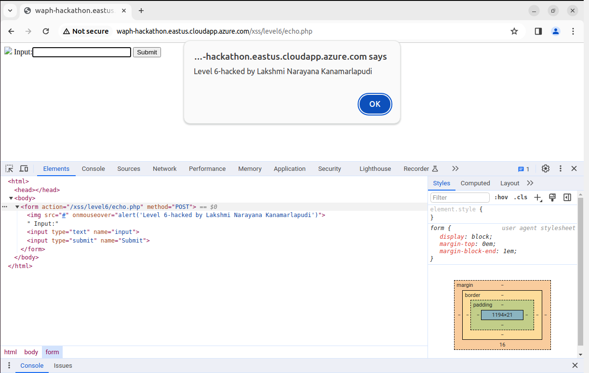
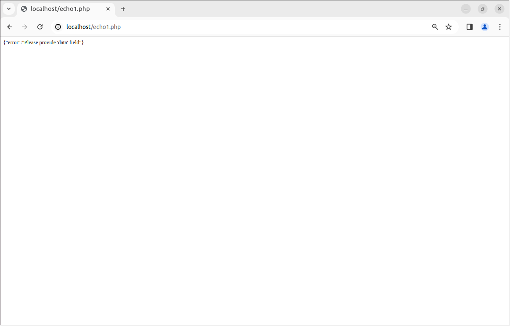
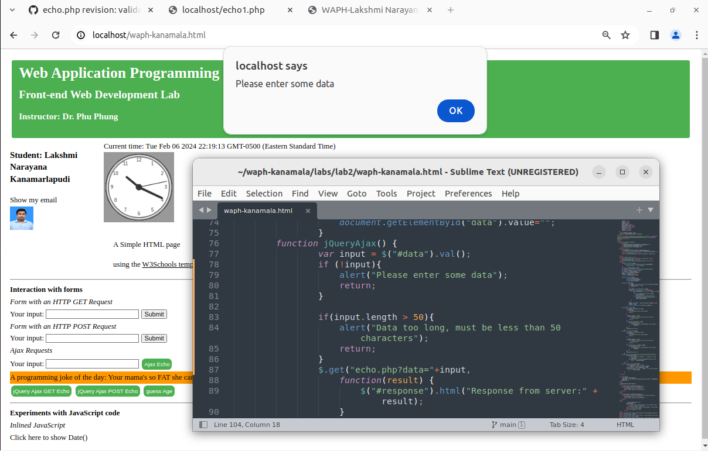
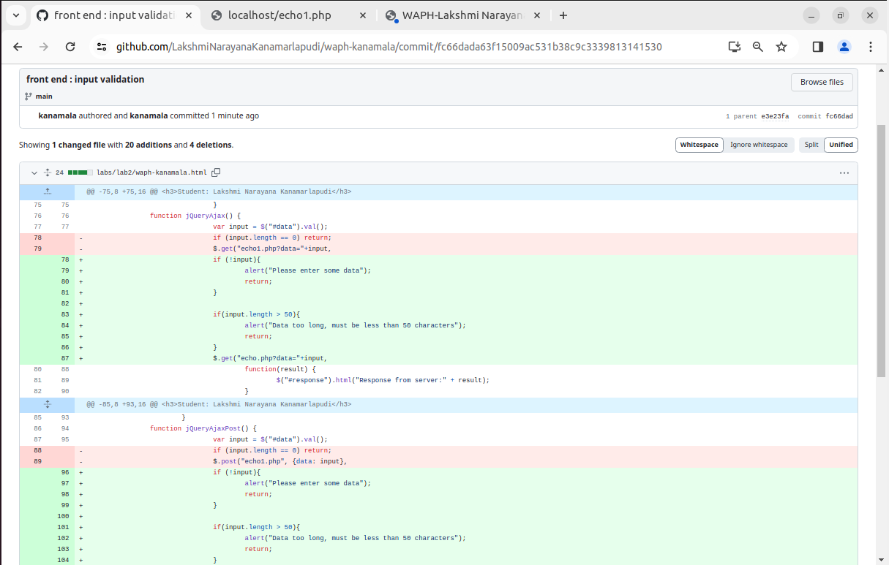
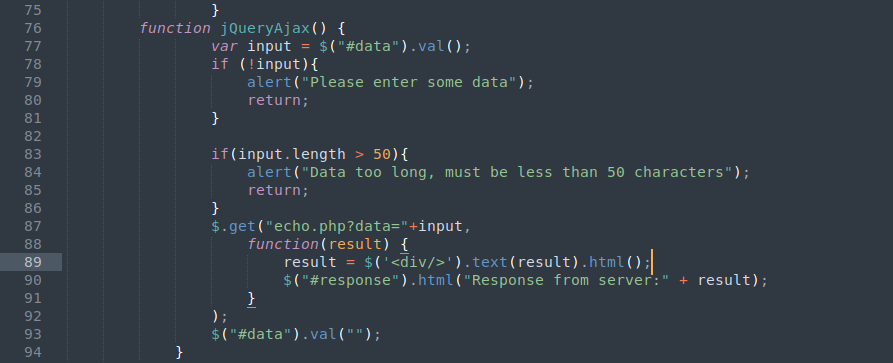

# WAPH-Web Application Programming and Hacking

## Instructor: Dr. Phu Phung

## Student

**Name**: Lakshmi Narayana Kanamarlapudi

**Email**: kanamala@mail.uc.edu

**Short-bio**: I am having interest towards data science and web development. 

## Repository Information

Respository's URL: [https://github.com/LakshmiNarayanaKanamarlapudi/waph-kanamala.git](https://github.com/LakshmiNarayanaKanamarlapudi/waph-kanamala.git)

This is a private repository for Kanamarlapudi Lakshmi Narayana to store all code from the course. The organization of this repository is as follows.

### Hackathons

[Hackathon Repository](Hackathons) 

  - [https://github.com/LakshmiNarayanaKanamarlapudi/waph-kanamala/tree/main/](https://github.com/LakshmiNarayanaKanamarlapudi/waph-kanamala/tree/main/): Hackathon 1

## Hackathon Overview
- This hackathon was all about the attacks, validation and encoding.
- Task 1 is about how the attacks will takes place on website.
- Task 2 is about how we need to do validations and encoding the data.

# Hackathon 1 - Cross-site Scripting Attacks and Defenses 

### Task 1: Attacks

- In this task we need to perform seven types of attacks to know different types of attacks.

- **Level 0**
- In this level we will be giving the alert pop message in the input field.
- When we click the submit button we will get a popup with that message provided.
- Output for level 0 is (fig2).  

- **Level 1**
- In this level i have used the script tag to inject message into the URL.
- Once we enter the url along with tag we will get popup stating that message provided in the tag.
- Output for the level 1 is (fig3).  

- **Level 2**
- In this level we need to work on the HTTP post request to acheive the output.
- So, In have taken the lab2 html file and edited the requirements like action from echo.php to the specified hackathon URL.
- Then i have also changed the input type to input because we need to give the input in the text field.
- Finally returned to the local host and executed the HTTP post request to get the popup.
- Level 2 code(fig4) & Level 2 output is (fig5).  

 

- **Level 3**
- In this level its a bit difficult because we have a filter in the server side.
- Like the server side code is removing the script tag. Because of that we are unable to get message.
- To make the popup possible i have wrote the script tag inside a script tag. So, first tag will be filtered out and second tag will helps to give the pop up.
- Level 3 output is (fig6).  

- **Level 4**
- In this the server side code is not allowing us to give the input field.
- To bypass this i have used body oncode tag in which we can give the input in the encoded format.
- So, for the encoding purpose i have used base64fromat. Then when we executed URL which contains the tag.
- I have got the popup message as an alert.
- Level 4 code is (fig7) & Level 4 output in (fig8).  

 

- **Level 5**
- In this level the server side code is more difficult because it is not allow any inputs tag to provide input.
- So, I have used the image tag but with using the source to provide the input. Insted of source used onerror.
- In this we will give the input in the from of ascii value. Then this tag will convert the ascii to text and helps us to get the popup message as a alert.
- Level 5 code is (fig9) & Level 5 output is (fig10).  

 

- **Level 6**
- In this level the server side code is in the encoded format.
- So, that it not allowing any type of script tags. Then i have used a image tag and included it in the level6 code using edit as html option.
- Finally, when i have moved the courser over the image it will displays the popup with the alert message.
- Level 6 output and code is in (fig11).  

### Task 2: Defences

- **echo.php**
- In this task i have performed some input validations using the lab1 echo.php file.
- Then when i have clicked on the submit button without giving the input it will gives message like "please provide some input".
- For this task code is in (fig12) & output is in (fig13) git commit history is in (fig14).  

 

 

- **Current front end prototype**
- I have provided the input validation to validate the data before using it.
- I have given some if statements to check the whether input was given or not and size of input.
- Then when i have clicked the submit button with out providing the input it provides the popup as an alert stating that "provide me some input.
- For this task code and ouput is in (fig15) & git change is in (fig16).  

 

- **Encode the data**
- In this task we need to perform the data encoding.
- To achieve this i have used the following type of code " $('
').text(result).html();".
- Where the given input will be encoded and stores in the server side.
- code is in (fig17) & git commit is in (fig18).  

 

