# waph-kanamala
# WAPH-Web Application Programming and Hacking

## Instructor: Dr. Phu Phung

## Student

**Name**: Lakshmi Narayana Kanamarlapudi

**Email**: kanamala@mail.uc.edu

**Short-bio**: I am having interest towards data science and web development. 

## Repository Information

Respository's URL: [https://github.com/LakshmiNarayanaKanamarlapudi/waph-kanamala.git](https://github.com/LakshmiNarayanaKanamarlapudi/waph-kanamala.git)

This is a private repository for Kanamarlapudi Lakshmi Narayana to store all code from the course. The organization of this repository is as follows.

### Labs 

[Hands-on exercises in lectures](labs) 

  - [https://github.com/LakshmiNarayanaKanamarlapudi/waph-kanamala/tree/main/labs/lab1](https://github.com/LakshmiNarayanaKanamarlapudi/waph-kanamala/tree/main/labs/lab1): Foundations of the Web
  

## Lab Overview

- Part 1 : The Web and HTTP Protocol. In this part we work with the wireshark and telnet.
- Part 2 : Basic Web Application Programming. This part we work with the web programming using C and php.

### Lab 1

**Part 1** The Web and HTTP Protocol  

**Task 1** Familiar with Wireshark tool and HTTP protocol

- Open the sandbox enviroment using the web browser.
- Then connect to the VM. And install the wireshark using terminal to do our work.
- Now open the wireshark using the following command " sudo wireshark &".
- In the wireshark we need to select the capturing options icon and click the any packet tracing.
- Now click on the start capturing option. So, then the tool will capture the packets.
- Then we can open a web browser and give some request.
- Now the wireshark will starts tarcing the packets.
- Then we can filter the http packets which are captured by the tool.
- Finally, this is how we work with the wireshark and HTTP protocol.
, 

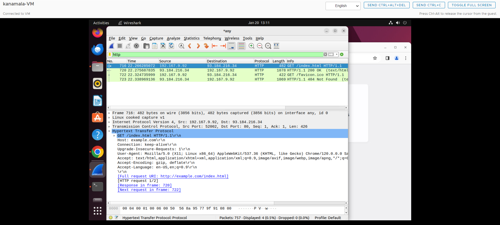

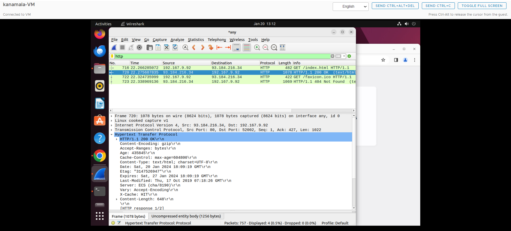

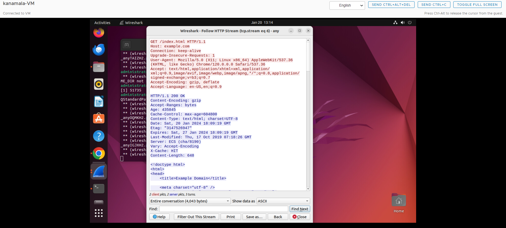

## Task 2 - Understanding HTTP using telnet and wireshark

- Telnet is one of the different way to give the request to the server and get the response from the server.
- For this we need enter the following command in the terminal to see the result "telnet example.com 80".
- "telnet" is the method we are using to estlablish the connection and following website url with the port number.
- Before entering the command we need to start the wireshark application and enable the packet tracker.
- So, all the packets will be traced and we can use them for our future analysis.
- Now, after entering the telnet command if the connection was successful then it will wait the commands to send to the server.
- Then we need enter the request and host details.
- Finally, we can get the HTTP response.  

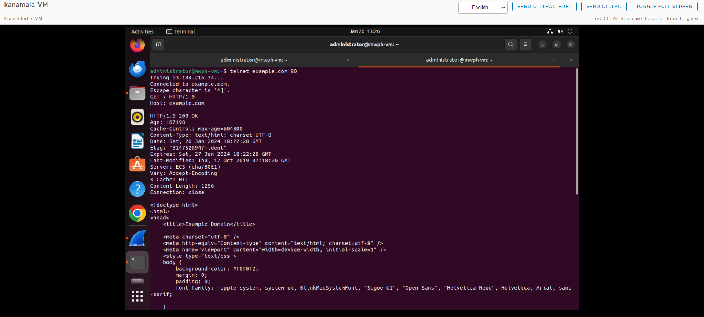

- When we are using two different methods we can expect some minimal differences in the content or format we are getting from that.
- Now when we are giving the telnet command to the terminal we need to give the following or support commands also, but when it comes to web request their is no need to enter any followup commands.
- We can see the diffrences like followup commands, port number.  

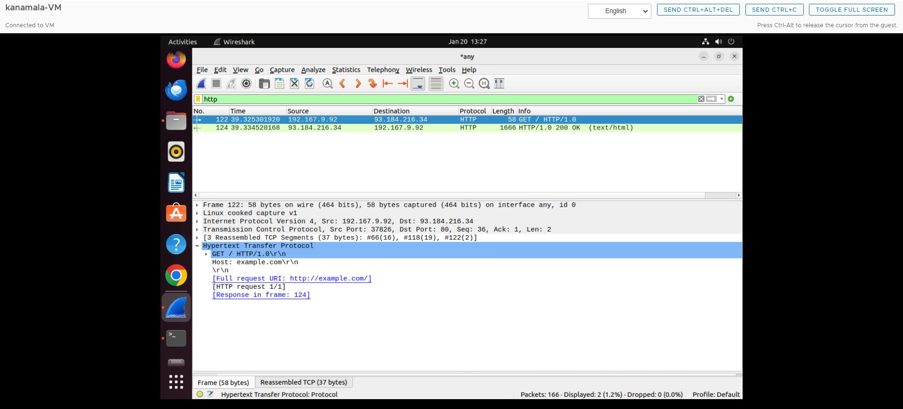

- The HTTP response which was generated from the terminal and web are mostly same.  

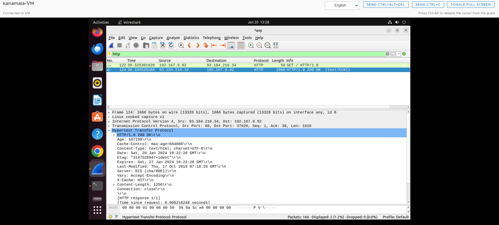

## Part-2 Basic web application programming

## Task-1 CGI Web applications in C

- a. To accomplish this task we need to install the gcc compiler using the following command "sudo apt  install gcc".
- Then we need to enable the cgi daemon using the following command "sudo a2enmod cgid."
- After that we make the changes permanent we need to restart the apache seerver.
- Now we are done with the pre-setup we good to start working with the code.
- We need to create a file helloworld.c and write the required code followed by saving the file.
- We can compile the file using the following command "gcc helloworld.c -o helloworld.cgi."
- For the next execution we need to execute the file using the following command "./helloworld.cgi."
- Then move the file to apache readable location.
- Finally we need to deploy the code using following command "sudo cp helloworld.c /usr/lib/cgi-bin".
- We can view the output by entering localhost followed by file name.  

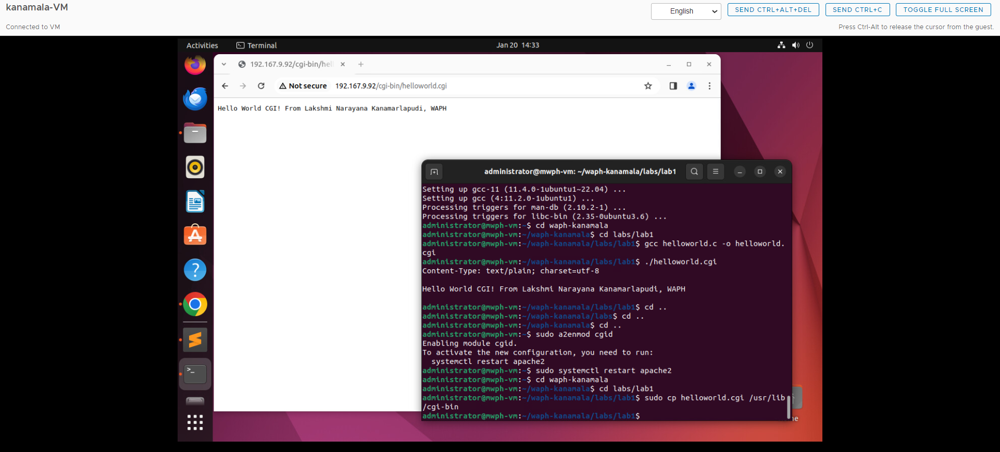

- b. This will be same as we did in the above helloworld cgi program.
- We need to create a file index.c and write the required code followed by saving the file.
- We can compile the file using the following command "gcc index.c -o index.cgi."
- For the next execution we need to execute the file using the following command "./index.cgi."
- Then move the file to apache readable location.
- Finally we need to deploy the code using following command "sudo cp helloworld.c /usr/lib/cgi-bin."
- We can view the output by entering localhost followed by file name.  

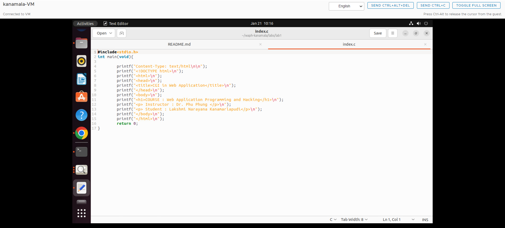

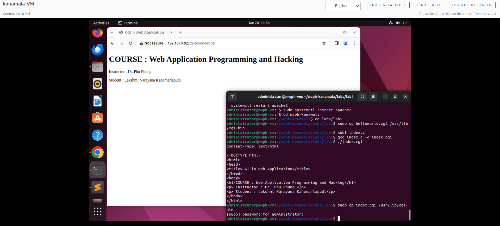

## Task - 2 A simple php web application with user input

- a. For this task we need have the php. We have to install the php using the following command *sudo apt-get install php libapache2-mod-php -y*.
- Now we are ready and will be able to run a php program.
- Then create a file with php extension and write the required code in it which is helloworld.php.
- To deploy the code we have to make sure it is in the following path /var/www/html.
- Finally, open any browser and give localhost/helloworld.php.  

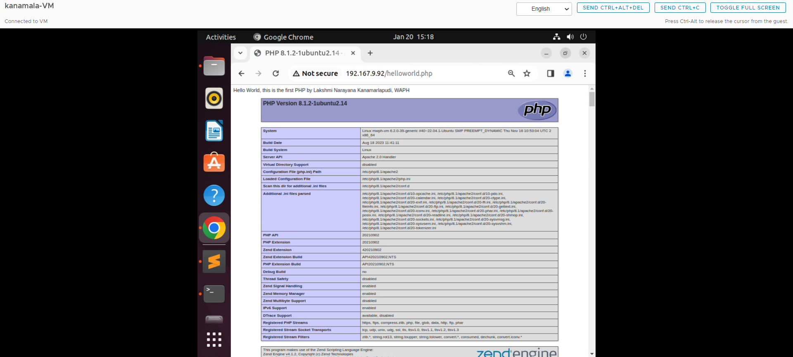

- b. Now create a file with php extension and write the required code in it which is echo.php.
- To deploy the code we have to make sure it is in the following path /var/www/html.
- Finally, open any browser and give localhost/echo.php and data = " the content we want have in the web".  

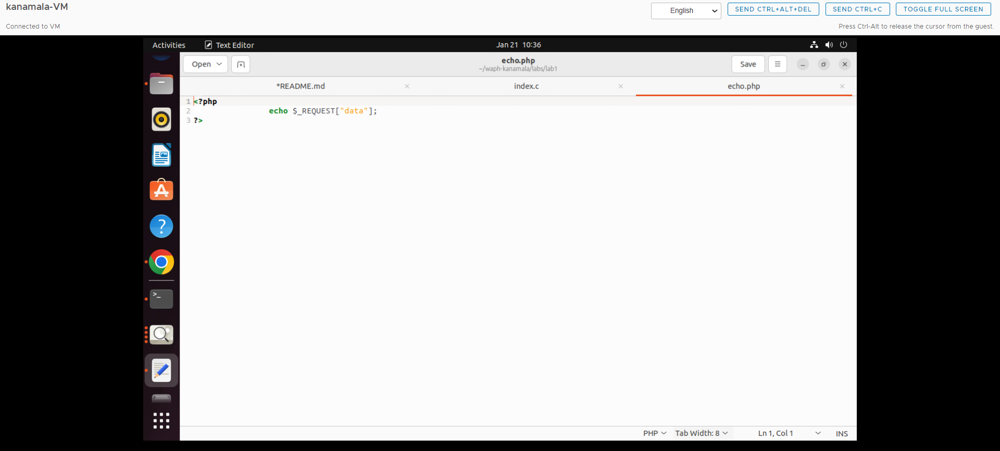

## Task - 3 Understanding HTTP GET and POST requests

- a. We are going to work on HTTP request and response.
- Now we have to start the wireshark, click on the capturing options and start the packet capturing.
- Then we have to run the php in web to capture the packets in the wireshark.
- Once the packets capturing was done we have to stop the capturing option.
- Then we can have detailed view of the HTTP request and response using the "show packet in new window" option.  

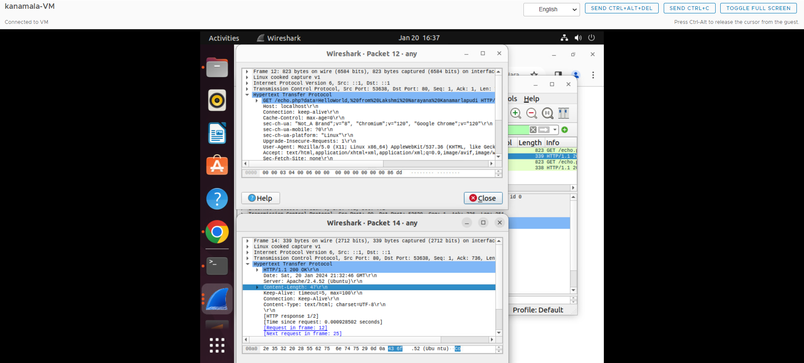

- b. Now we are going understand the HTTP POST request.
- To acheive the above task we need to install the curl using the following command "sudo apt install curl".
- Then open the terminal and give the following curl command *Curl -X POST http://localhost/echo.php -d "data="Hello world, Lakshmi narayana Kanamarlapudi*.
- Before that we need to enable the wireshark packet capturing.
- Then we can see the response from the server in the terminal.  

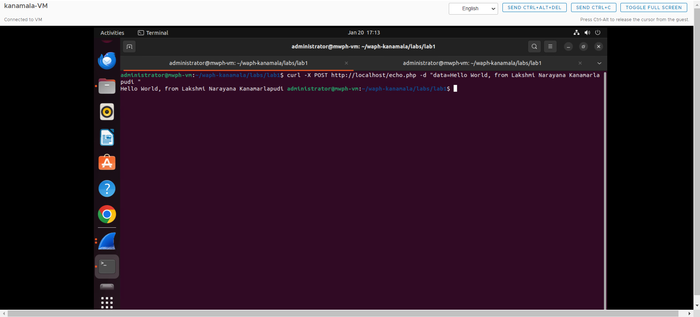

- For the detailed view of both the request and response we can use the HTTP stream.  

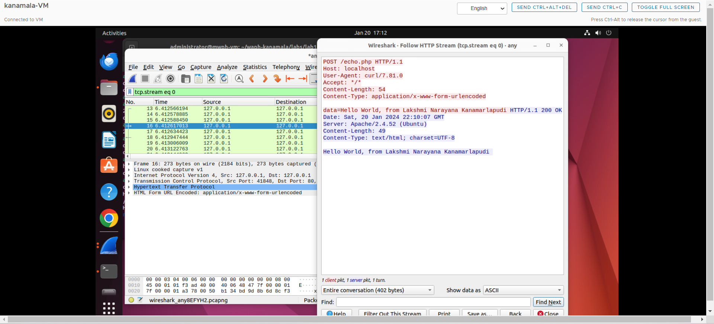

**Difference between GET and POST**

- c. GET request is processed through the url.
- The POST request is processed through the command in a terminal.
- The GET request is to pull the data from a source.
- Where as POST request is used to insert or update the data.
- The required data is visible in URL in the format of parameter.
- The data is not visible in the URL but will avaialbe as a body.
- The response in the terminal and wireshark will have the same information and fields.

