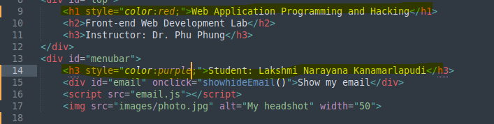
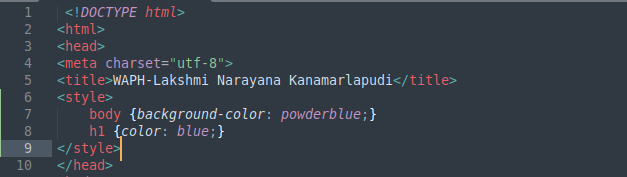

# waph-kanamala
# WAPH-Web Application Programming and Hacking

## Instructor: Dr. Phu Phung

## Student

**Name**: Lakshmi Narayana Kanamarlapudi

**Email**: kanamala@mail.uc.edu

**Short-bio**: I am having interest towards data science and web development. 

## Repository Information

Respository's URL: [https://github.com/LakshmiNarayanaKanamarlapudi/waph-kanamala.git](https://github.com/LakshmiNarayanaKanamarlapudi/waph-kanamala.git)

This is a private repository for Kanamarlapudi Lakshmi Narayana to store all code from the course. The organization of this repository is as follows.

### Labs 

[Hands-on exercises in lectures](labs) 

  - [https://github.com/LakshmiNarayanaKanamarlapudi/waph-kanamala/tree/main/labs/lab2](https://github.com/LakshmiNarayanaKanamarlapudi/waph-kanamala/tree/main/labs/lab2): Front-end Web Development
  

## Lab Overview

**Task-1 : Basic HTML with forms and javascript**
- In this task we can learn about the basic tags and forms. Their we can also get to know how to use java script.
- In this task as a second section we can also learn about the digital clock, email hide and unhide, analog clock

**Task-2 : Ajax, CSS, jQuery and Web API Integration**
- In this part we learned about the ajax get request and response and about buttons.
- Also we can learn the styling part which includes inlined, internal and external styling.
- we will learn about the jQuery and web api integration using the simple joke and guess api's.

### Lab 2

**Task-1 : Basic HTML with forms and javascript**

**A**

- In this task we have to created a basic html file with an image tag in it.
- Where I have used h1,h2,h3 tags for the headings and a image tag to insert the headshot in it.
- And also used a form tag to insert the form to check the HTTP get and post request using the echo.php file.
- The following is the form tag "<form action="" method="">"
- The following is the image tag "".
- Also created buttons to test the get and post request. 
- Basic HTML code is (fig2) & Basic HTML output is (fig3)  

**B**

- Firstly i have inserted a code in the html file to display basic digital-clock which shows the current date and time.
- For this once the html file was opened web browser we will see a digital clock. If we click on it it will shows the current date and time.
- we have used the inline java script to acheive the task.
- Digital-clock code is (fig4) & Digital-Clock image output (fig5)  

 

- This is also similar to the above task but here we have used the javascript to get the output.
- Here we have used a fuction called "fuction displayTime". And also we have used the setInterval fuction to give an time interval of 500
- Below is the source code and output. 
- Digital-Clock with javascript code (fig6) & Digital-Clock with javascript output (fig7)  

- In this we are trying acheive that when we click on show my email id it have to show the email.
- upon another click it has to hide the email. For this we have created a java script file with the specified coding to acheive the task.
- For that we have created a js file in that we have included the required fuctions and elements like "function showhideEmail" and " document.getElementById('email').innerHTML = "Show my email";" are used to make the task.
- The output and the source code are as follows. 
- email javascript code (fig8)& email code (fig9) & email output (fig10)  

- In this task we are produing a analog clock for the extension of digital clock which was done in the previous tasks.
- We have used the canvas tag to get the 2 dimensional context to the clock.
- Here I have also defined the radius,ctx and interval for the clock.
- And then finally used the draw fuction to display the analog clock. "fuction draw()"
- The source code and output are shown below. 
- Analog clock code (fig11) & Analog clock output(fig12) 

## Task 2 - Ajax, CSS, jQuery and Web API Integration

**A - Ajax**

- Ajax is the one which can request the server and get the response form the server without reloading the web page.
- "function get echo" has been used to take care of the input which the user input.
- Then "xhttp on readystate" is the which takes care about the request, respone and display of the response.
- After that the get request will be handled by the echo.php which a php program.
- Once after the request was submitted and the their will be state of the reponse which was estimated in numerical. That it start from one and if it equals to four and the status is 200 then the response will be displayed.
- We can also the check the network log to see the request and response. 
- Ajax source code (fig13) & Ajax output (fig14) & Ajax output network fig(15)  

- I have observed the network window in which we can get to the request and response.
- In which i have seen the request method as GET and status code as 200.
- We can also check connection status, remote code and many more.

**B - CSS**

- In this task we will acheive the styling process which provides the interactiveness to the webpage.

**Inline style**

- Inline style is a simple style tag which is used to give the basic color to the text in the webpage.
- Where we will include the style inside the heading tag itself. 
- inline source code (fig16) & inline source output (fig17)  

**Internal CSS**

- Internal CSS is a style format where we can define the style for the multiple contents and backgrounds also.
- For this internal CSS we will write a separate script defining the colour and style for the contents in the webpage.
- I have added the style to the heading tag and the background of the website. Which are powder blue to the background and blue for the heading tag. 
- internal source code (fig18) & internal output (fig19) 

**External CSS**

- External CSS is nothing but accquiring the style and color of the outside webpages.
- For this we have added the style sheet using the "rel" and "herf" tag.
- We have added this required code to our html file from the github source which will change our whole page style and color as per the desired values.
-  Here we have added green color to the desired values. 
- external source code (fig20) & external output (fig21) 

**C - jQuery**

- **jQuery-GET**
- A fuction call jQueryAjax has been defined to handle the get function. Where we have also created a button at the bottom of the html page to add a button.
- I have written a length variable to check the length of the input. And the input will be handled by the echo.php.
- Where "$.post("echo.php", {data: input}" $get will sends the get request to the echo.php with an input parameter.
- "fuction result" and the inside line of the code will displays us the reponse which is got from the server.
- In this way all the code and process will works. 
- jQuery GET source code (fig22) & jQuery GET output (fig23)  

- **jQuery-POST**
- This is as same as the above one the only difference is method. This POST request method.
- I have created a "jQueryAjaxPost" function which is call the post method. And inside the fuction defined a variable called data to check the input from the user.
- And a length variable has been assigned which will checks the length of the data. $post will sends the post request to the echo.php.
- fuction result will display us the response which we got .
- The network window will be same as of the get request. The only change is request method. Here we got it has POST.  
- jQuery POST source code (fig24) & jQuery POST output (fig25)

**D - Web API Integration**

- **JOKE API**

- Joke api is used to generate the random joke in the web page, where a new joke will be generated every time when we refresh the web page.
- Web page integration is one of the best feature which will makes our work simple and also we can used api as per our requirement.
- For this we are using the API. Where I have writtened a code as per the requirements of the task.
- "$get" will sends the request to the API, which also make sures that only one joke should be printed at a time.
- A callback function was written which is "fuction(result)" which will displays us the response which was came from the API.  
- Where i have also analysed the network window in which the request method was "GET".  
- Joke API source code(fig26) & Joke API output(fig27)

- **Guess API**

- Name API is used to guess the age of the input everytime when a new name was entered.
- For this firstly a button was created the code was included at the end of the html code.
- Then asynchronous fuction was written which is called "guessage" with a parameter "name".
- "const reponse" is a variable which is used to fetch the data form the API and await will waits until the response was came from the API.
- And along with the "$response" string concatination was included to make a greeting text along with the input data.
- Finally the age will be displayed along with the name.
- Where i have also analysed the network window in which the request method was "GET".   
- Guess API source code fig(28) & Guess API source code(fig29)

